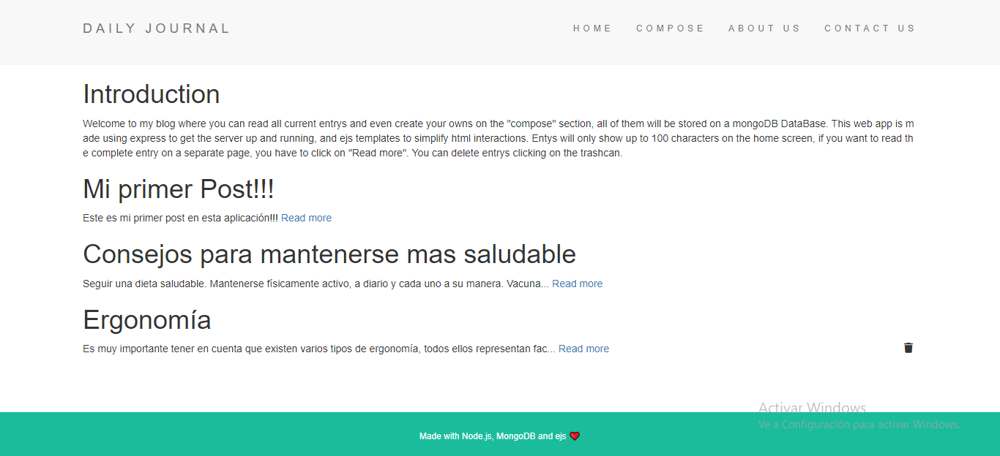
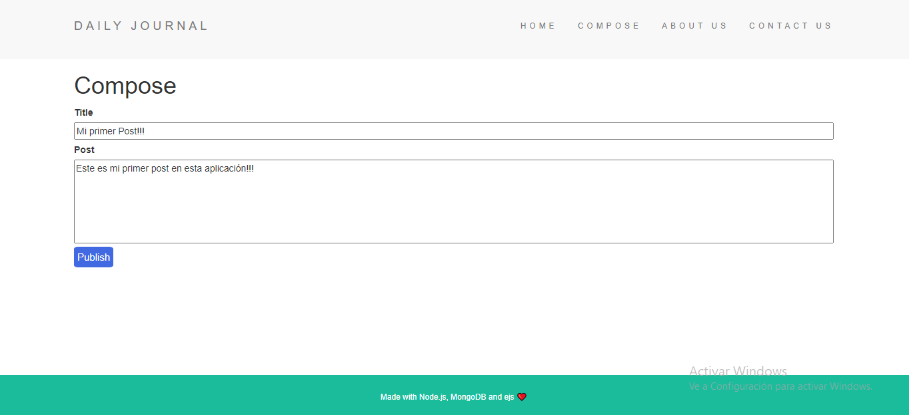

# Blog
Blog project using Node and MongoDB.

### Descripción
Este proyecto es una aplicacion web que consiste en una pagina principal en la que se puede leer un resumen de todas las entradas de un blog, cada entrada muestra hasta 100 caracteres, si se desea ver una entrada completa, o ver una en una de forma independiente, se debera hacer click en el enlace "Read more". Esto te mostrara solo la entrada selecionada. Tambien se pueden borrar entradas seleccionando el icono de basura en cada entrada, esto la elimina de la base de datos en la que se encuentra almacenada. A su vez existen pestanias en la barra de navegacion que llevan a diferentes seccion, siendo una "Compose", seccion en la que se pueden crear entradas propias. Todas las entradas se guardan en una base de Datos usando MongoDB y Mongoose.
La aplicacion esta diseniada utilizando ejs para simplificar la interaccion entre las plantillas HTML y el servidor.

### Como utilizar
La aplicación esta hecha en node y se ejecuta a partir del archivo app.js, la app necesitara conectarse a una base de datos local en MongoDB para funcionar.

***

***

